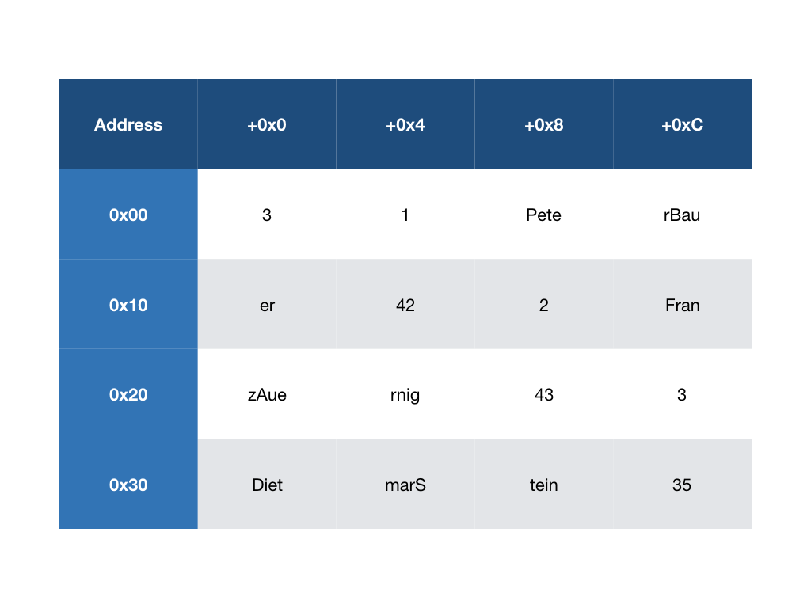

# Binary File Utilities
## General Description
You are to write a number of small unix tools which maintain a binary file called `students.dat` holding students data. The following tools shall be implemented:

- `init` initialize a students file
- `new_student` add new student data which is entered by the user to the file
- `list_all_students` list all student 
- `display_student <id>` displays the student with the id as given in the command line parameter
- `update_student <id>` lets the user update the student with the id given in the command line parameter

The student's data to be stored shall consist of
- an id
- the first name
- the last name
- the age.

## Example
A typical procedure to use the tools would be:
```
Peters-MacBook-Pro-2:binary-file-utility peter$ ./init
Peters-MacBook-Pro-2:binary-file-utility peter$ ./add_student
First Name: Peter
Last Name: Bauer
Age: 42
Stored successfully
Peters-MacBook-Pro-2:binary-file-utility peter$ ./add_student
First Name: Franz
Last Name: Auernig
Age: 43
Stored successfully
Peters-MacBook-Pro-2:binary-file-utility peter$ ./add_student
First Name: Didi
Last Name: Steiner
Age: 35
Stored successfully
Peters-MacBook-Pro-2:binary-file-utility peter$ ./list_all_students
Id         First Name  Last Name  Age
0000000001 Peter       Bauer      42
0000000002 Franz       Auernig    43
0000000003 Didi        Steiner    35
Peters-MacBook-Pro-2:binary-file-utility peter$ ./display_student 2
First Name: Franz
Last Name: Auernig
Age: 43
Peters-MacBook-Pro-2:binary-file-utility peter$ ./update_student 3
First Name: Dietmar
Last Name: Stein
Age: 35
Stored successfully
```
## File Layout
The resulting file after doing the last example would look like this (of course, not visible in an editor in this way). Take care that every record for one student has exactly the same length. Also note that the sizes of the fields `first_name` and `last_name` are 12 bytes together which is just for the sake of brevity and, of course, is a bit short and not realistic at all. Finally see the first four bytes carrying the number 4 which is the id for the next student to be stored.


## Init
`init` creates a file `student.dat` and writes the integer number 1 at the beginning of the file. This number is necessary to keep track of the id to be assigned to the next student which is stored to the data file

## New Student
`new_student` asks the user for the necessary student's data (first name, last name and age), assigns a new id to the student's record and stores it to the file. Take care that the id is taken from the first integer number stored. You have to guarantee that this number is not overwritten by the newly added student's record. Finally this number has to be incremented by 1 to keep track of the next id to be assigned.

## List all Students
`list_all_students` prints all students' data into the terminal (id, first name, last name, age). This is done in a tabular form as given in the example above.

## Display Student
`display_student` prints one student's data into the terminal. The id of the student to be printed is taken from the command line argument. Take care that you shall use the fact that every student record has the same length. Therefore you need not read every record until you reach to the record requested. Moreover you can directly jump to the correct position via `lseek`.

## Update Student
`update_student` updates one student's data. The id of the student to be updated is taken from the command line argument. Again jump directly to the position in the file with `lseek`.

## Hints
- You may assume that the student with the id `i` is at the `i`th place in the file.
- Getting the command line argument is done via the `int argc` and `char* argv[]` parameters of the `main` function.
- Build each tool with the standard options `-Wall -pedantic -std=c99`.
- For getting the formatted output one can use `printf` with the following format string: `"%010d %-32s %-32s %-3d"`.
